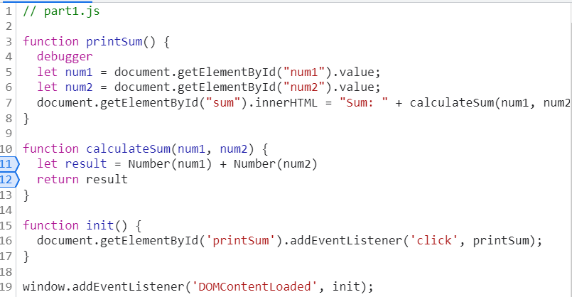

1. What was the bug?

The bug was that num1 and num2 are both type strings. When calculateSum does addition between num1 and num2, it actually concatenates the two strings and returns the concatenation. For instance, if num1 = 1 and num2 = 2, then the result will be 12 instead of 3.

2. How would you fix it?

I would change the data type of num1 and num2 to be numbers by adding the code Number() with num1 and num2 as the input. This is shown in line 11 of the code image. This will fix the bug by changing them into numbers that will be added together instead of strings concatenated together.